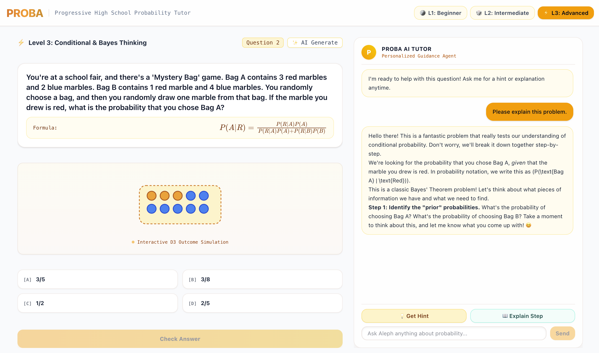

<div align="center">

# 🎲 PROBA

### Interactive & Adaptive High-School Probability Tutor

<p align="center">
  
</p>

[](https://kit.svelte.dev)
[](https://svelte.dev)
[](https://tailwindcss.com)
[](https://d3js.org)
[](https://www.mathjax.org)
[](https://openrouter.ai)

</div>

---

## 🌟 Overview

**PROBA** is an adaptive, single-viewport interactive web app designed to guide high-school students through learning probability step-by-step. By combining real-time **D3.js outcome simulations**, mathematical typesetting with **MathJax**, and an embedded **OpenRouter AI Agent ("Proba")**, students build visual intuition and problem-solving confidence.

---

## ✨ Key Features

- **🎯 Progressive Learning Levels**:
  - **Level 1 (Beginner)**: Sample spaces, fair coin flips ($P(\text{Heads}) = \frac{1}{2}$).
  - **Level 2 (Intermediate)**: Dice rolls & marble bag distributions.
  - **Level 3 (Advanced)**: Dependent events & conditional probability ($P(A \mid B)$).

- **🤖 Proba AI Guidance Agent**:
  - **Dynamic Hint Generator**: Provides scaffolded hints without spoiling answers.
  - **Step-by-Step Explanations**: Explains the underlying intuition behind every solution.
  - **Interactive Math Chat**: Ask custom questions in real-time with automatic LaTeX typesetting.

- **🎲 Interactive D3.js Simulations**:
  - Animated visual outcome models for coins, multi-side dice, and marble sampling without replacement.

- **✨ Infinite AI Problem Generation**:
  - Click **"✨ AI Generate"** to produce fresh, level-tailored probability questions dynamically generated by the OpenRouter AI model.

- **📐 Fit-to-Screen Single Viewport**:
  - Clean, zero-scroll light layout designed for laptops, tablets, and desktops.

---

## 🚀 Quick Start

### 1. Prerequisites

- Node.js `v18+`
- npm `v9+`

### 2. Installation

```bash
git clone <repository-url>
cd probability
npm install
```

### 3. Configure Environment Variables

Create a `.env` file in the root directory:

```env
LLM_API_KEY=your_openrouter_api_key_here
```

### 4. Run Development Server

```bash
npm run dev
```

Open [http://localhost:5173](http://localhost:5173) in your browser.

---

## 🛠️ Built With

- **Framework**: [SvelteKit 2](https://kit.svelte.dev) + [Svelte 5 (Runes)](https://svelte.dev)
- **Styling**: [Tailwind CSS 3.4](https://tailwindcss.com) + Google Fonts (Plus Jakarta Sans, Outfit, JetBrains Mono)
- **Visualizations**: [D3.js v7](https://d3js.org)
- **Math Notation**: [MathJax 3](https://www.mathjax.org)
- **AI Agent Endpoint**: [OpenRouter API](https://openrouter.ai) (`google/gemini-2.5-flash`)
- **Validation**: [Zod](https://zod.dev)

---

<div align="center">
  <sub>Built with ❤️ for CIID Probability Exploration</sub>
</div>
